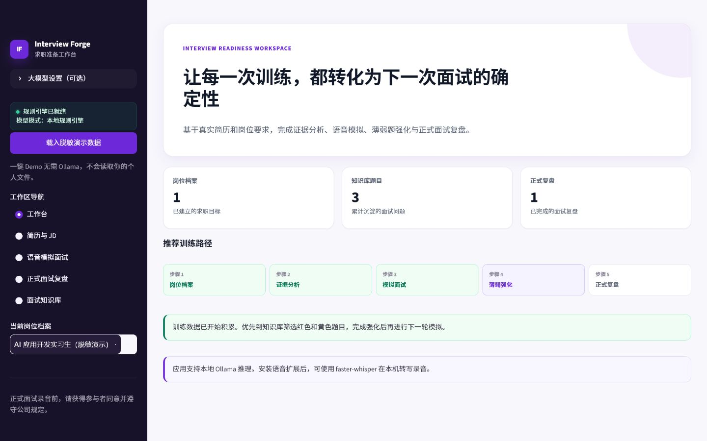
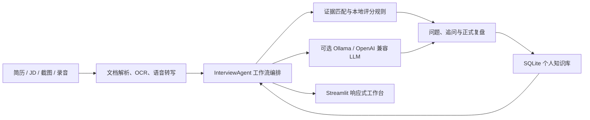

# Interview Forge

> 本地优先的求职训练工作台：把简历/JD 证据分析、模拟面试、动态追问、正式面试复盘和薄弱题强化连接成一个可持续迭代的工作流。




## 项目价值

多数面试工具只完成一次问答。Interview Forge 将训练过程沉淀为可检索的数据闭环：

1. 从真实简历和岗位 JD 中定位证据覆盖、弱证据和缺失项。
2. 基于岗位上下文生成问题，按回答质量动态追加追问。
3. 保存每道题的回答、评分、不足和改进框架。
4. 在正式面试结束后提取问题并生成会后复盘。
5. 将红色/黄色薄弱题重新送回下一轮训练。

项目坚持真实性：不会替候选人编造职责、指标或技术栈；无法确认的信息会标记为待确认。

## 一键体验

Windows PowerShell：

```powershell
.\run_demo.ps1
```

脚本会创建本地虚拟环境、安装锁定依赖、使用独立 `data/demo.db`，并自动载入完全虚构的简历、JD、面试记录和训练结果。**体验 Demo 不需要 Ollama，也不会读取个人文件。**

也可以启动普通模式后，在侧栏点击“载入脱敏演示数据”：

```powershell
.\run.ps1
```

浏览器访问 `http://localhost:8501`。

## 核心功能

- 导入 PDF、DOCX、TXT、Markdown、图片或剪贴板截图。
- 使用本地 RapidOCR 识别简历/JD 截图并允许人工校对。
- 生成“岗位要求—简历证据—修改建议”匹配矩阵。
- 生成岗位定制问题，支持浏览器朗读、麦克风录音和文字作答。
- 使用规则与可选 LLM 混合评分，并根据薄弱点动态追问。
- 导入正式面试录音或转写，提取问题并完成逐题复盘。
- 使用 SQLite 保存岗位档案、训练问题和正式复盘。
- 按关键词、来源和红/黄/绿等级检索个人面试知识库。
- Ollama/OpenAI 兼容服务不可用时自动回退到确定性规则。

## 系统架构



核心调用链：

```text
app.py
  -> InterviewAgent
      -> analysis.py / interview.py       # 确定性分析与降级路径
      -> LLMClient                         # Ollama / OpenAI 兼容适配
      -> Storage                           # SQLite 持久化
  -> documents.py / speech.py             # PDF、DOCX、OCR、Whisper
  -> ui.py                                 # 统一主题与交互组件
```

## “Agent”能力边界

本项目中的 Agent 是一个**有状态的领域工作流编排器**：它根据简历、JD、历史薄弱题和本轮回答选择问题、评价、追问及复盘路径，并将结果写回知识库。

它不是具备任意工具调用、自主任务规划或长期自主执行能力的通用 Agent。这样的描述更符合当前实现，也便于招聘方从真实代码路径评估项目。

## 技术栈

| 层级 | 技术 | 用途 |
|---|---|---|
| UI | Streamlit、原生 CSS | 响应式工作台、录音、文件导入、状态反馈 |
| Agent 编排 | Python、dataclass | 岗位分析、出题、评分融合、动态追问、正式复盘 |
| 本地模型 | Ollama `/api/chat` | 自动发现模型、关闭 thinking、结构化 JSON 输出 |
| 兼容模型 | OpenAI-compatible API | 可选远端或自建推理服务 |
| 文档处理 | pypdf、python-docx、Pillow、RapidOCR | PDF/DOCX/文本/图片提取 |
| 语音 | Web Speech API、faster-whisper | 浏览器朗读、本地录音转写 |
| 数据 | SQLite | 岗位档案、题目、评分和复盘持久化 |
| 质量保障 | Pytest、Streamlit AppTest、GitHub Actions | 单元、适配器、异常路径和五页面回归 |

## 示例输入与输出

仓库提供三份完全虚构的演示材料：

- [`examples/sample_resume.md`](examples/sample_resume.md)：含项目职责、技术方案和量化结果的示例简历。
- [`examples/sample_jd.md`](examples/sample_jd.md)：AI 应用开发实习生示例 JD。
- [`examples/sample_transcript.txt`](examples/sample_transcript.txt)：带说话人标签的正式面试转写。

一键 Demo 会生成：

- 1 个岗位档案；
- 3 道带红黄绿等级和改进建议的知识库题目；
- 1 份正式面试复盘；
- 可继续操作的完整训练状态。

## Ollama 配置

应用会自动探测 `http://127.0.0.1:11434/api/tags` 并选择本机模型。也可在侧栏手动填写：

```text
Base URL: http://localhost:11434/v1
模型名称: qwen3:4b
API Key: 留空
```

检测到本机模型时，下拉列表末尾仍会提供“手动输入其他模型…”。使用者可以填写 `deepseek-r1:7b`、其他 Ollama 模型，或当前 OpenAI 兼容服务暴露的任意模型名称。应用不会自动下载模型，请先确保对应推理服务可以访问该模型。

Ollama 调用使用原生 `/api/chat`，关闭 thinking，并限制结构化输出长度。模型调用失败时，核心流程会回退到本地规则，不会因服务离线而中断。

## 本地语音转写

```powershell
.\install_audio.ps1
```

默认使用 faster-whisper `base` 模型；首次转写会下载模型。可通过环境变量调整：

```powershell
$env:WHISPER_MODEL = "small"
```

## 隐私设计

- 默认将简历、JD、转写、评分和录音保存在本机 `data/`。
- SQLite 数据库、录音、日志和环境变量文件均被 `.gitignore` 排除。
- API Key 仅保存在当前 Streamlit 会话，不写入数据库。
- 只有用户主动配置远端 OpenAI 兼容服务时，相关提示内容才会发送到该服务。
- 正式面试录音必须先确认已获得参与者同意；该模式只做记录和会后复盘，不生成面试中的隐蔽答案提示。
- `examples/` 中的姓名、公司、岗位和指标均为虚构数据，可安全用于展示。

## 已知局限

- 本地规则的岗位匹配主要基于技能词和文本证据，不等同于 embedding 语义匹配。
- 小参数模型的评分可能波动，因此实现会将模型分数限制在本地基线附近再融合。
- 正式复盘在无 LLM 时依赖“面试官/候选人”说话人标签，转写后需要人工校对。
- faster-whisper 首次使用需要下载模型，CPU 转写速度取决于硬件。
- 当前为本地单用户应用，尚未实现账号、加密存储或多租户权限控制。

## 测试与工程验证

```powershell
.\.venv\Scripts\python.exe -m pytest -q
.\.venv\Scripts\python.exe -m compileall -q app.py src
.\.venv\Scripts\python.exe -m pip check
```

当前验证结果：

```text
14 passed
compileall: OK
pip check: No broken requirements found
Streamlit: 五个页面均通过 AppTest 回归
Ollama qwen3:4b: 项目真实评分链路验证通过
```

测试覆盖核心匹配/评分、SQLite 往返、Demo 幂等性、Ollama 与 OpenAI 兼容请求、网络失败回退、文档编码、语音依赖错误，以及所有主要页面。

## 项目结构

```text
Interview_forge/
├─ app.py                         # Streamlit 入口与页面工作流
├─ src/interview_forge/           # Agent、分析、LLM、文档、语音、存储与 UI
├─ examples/                      # 完全虚构的演示材料
├─ tests/                         # 单元、集成与页面回归测试
├─ docs/assets/                   # README 产品截图
├─ .github/workflows/ci.yml       # Python 3.11/3.12 CI
├─ run.ps1                        # 普通模式
├─ run_demo.ps1                   # 一键脱敏 Demo
└─ install_audio.ps1              # 可选本地语音依赖
```

## 版本与许可证

当前版本：`v1.0.0`。变更记录见 [`CHANGELOG.md`](CHANGELOG.md)。

项目采用 [MIT License](LICENSE)。
